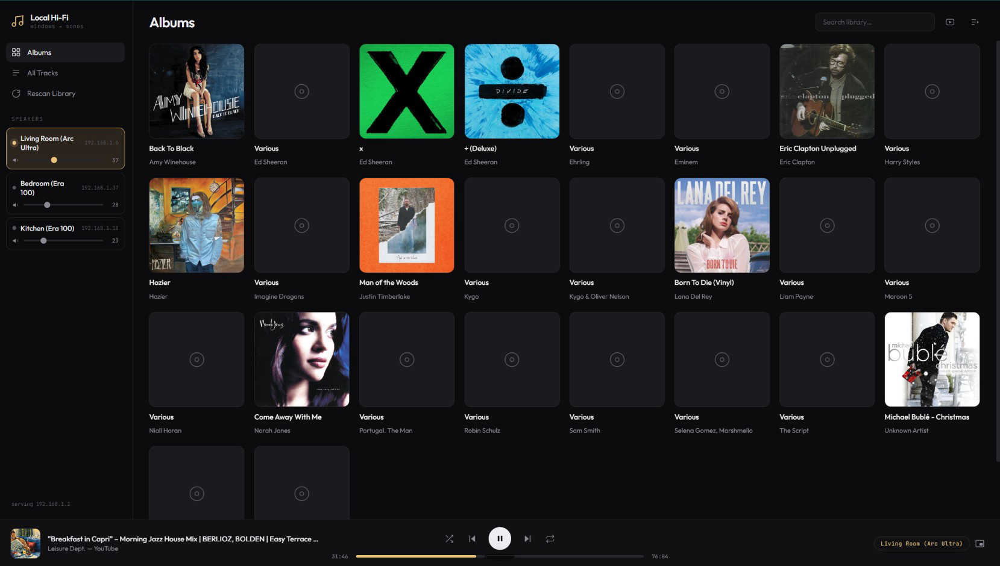
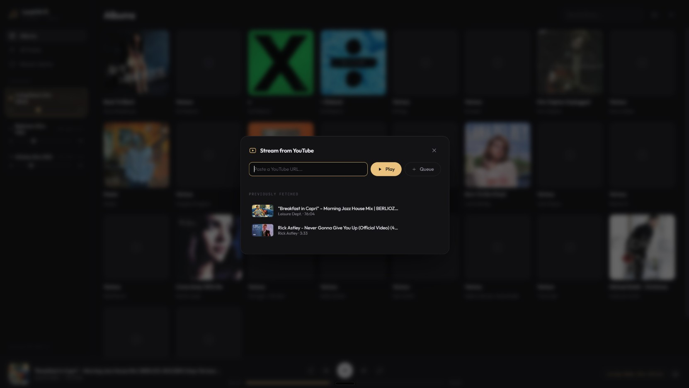

# Windows-to-Sonos — Local Hi-Fi

Stream the music folders on your Windows laptop directly to your Sonos
speakers, lossless, from a web player in your browser. No Sonos "Music
Library" share, no SWYH, no casting — the speakers pull the audio straight
from your laptop over your network, the same way they would from a NAS.



## Features

- **Lossless streaming** — FLAC/WAV bit-perfect up to 24-bit/48kHz; hi-res
  files (24/96 and above) are transcoded once, automatically
- **Sonos volume and group control** — per-speaker volume sliders, and click
  multiple speakers to group them for synced multi-room playback
- **Stream YouTube (music) videos directly, without commercials** — paste a
  URL in the overlay and its audio plays on your speakers; fetched audio is
  cached for instant ad-free replay, with full seek support
- **Full player** — queue with live position tracking, shuffle, repeat,
  seek, album art, search
- **Adaptive UI** — the accent color follows the artwork of what's playing
- **Mini player** — always-on-top floating window (Chrome/Edge) with
  transport controls
- **Zero build step** — Python backend, vanilla JS frontend, one command to run



## Quick start

```powershell
cd Windows-to-Sonos
.venv\Scripts\python.exe app.py
```

Then open **http://127.0.0.1:8756** in your browser (use `127.0.0.1`, not
`localhost` — the latter stalls ~2s per request on Windows due to IPv6
resolution).

- Pick a speaker in the left sidebar (click more than one to group them —
  they play in sync).
- Click an album to see its tracks, or hit the play button on the cover.
- Queue, shuffle, repeat, seek, and per-speaker volume all work from the bar
  at the bottom.
- The YouTube button (top right) opens an overlay: paste a video URL and its
  audio plays on the selected speakers. Fetched audio is cached, so replaying
  is instant; previously fetched items are listed in the overlay.

## First-time setup (already done on this machine)

```powershell
python -m venv .venv
.venv\Scripts\python.exe -m pip install -r requirements.txt imageio-ffmpeg
```

**Windows Firewall** must allow the speakers to reach the laptop — without
this, playback silently fails (this is why SWYH and "Cast to Device" never
worked). One admin PowerShell command:

```powershell
New-NetFirewallRule -DisplayName "Windows-to-Sonos" -Direction Inbound `
  -Protocol TCP -LocalPort 8756 -RemoteAddress LocalSubnet -Action Allow
```

## Configuration — `config.json`

```json
{
  "port": 8756,
  "music_folders": ["C:\\Users\\basva\\Music"],
  "speakers": [
    { "name": "Living Room (Arc Ultra)", "ip": "192.168.1.6" },
    { "name": "Bedroom (Era 100)", "ip": "192.168.1.37" },
    { "name": "Kitchen (Era 100)", "ip": "192.168.1.18" }
  ]
}
```

Add more folders or speakers and restart the server (or use **Rescan
Library** in the sidebar for new music).

## Auto-start on login

To have the server start automatically and restart itself if it ever
crashes, register a Windows Scheduled Task once:

```powershell
cd Windows-to-Sonos
.\setup_autostart.ps1
```

This runs `run_server.bat` at logon and retries automatically on failure.
Startup crashes are logged to `logs\server.log` (there's no terminal to read
them from once the server runs this way). Remove it later with
`Unregister-ScheduledTask -TaskName "Windows-to-Sonos"`.

## Lossless & hi-res

FLAC and WAV stream bit-perfect up to Sonos's ceiling of **24-bit/48kHz**.
Anything above that (24/96 FLAC, 32/96 WAV, ...) is automatically downsampled
once to 24/48 FLAC — still lossless encoding, inaudibly different — and cached
in `.cache/transcode/`, so it only happens the first time you play a track.

## Troubleshooting

| Symptom | Fix |
|---|---|
| Speaker shows the track but stays silent/stopped | Check the firewall rule above; then check the file isn't above 24/48 without the transcoder running |
| Speaker "unreachable" in the sidebar | Confirm its IP in `config.json` — Sonos IPs can change unless you reserve them in your router (recommended) |
| New music missing | Sidebar → Rescan Library |
| Wrong laptop IP after switching networks | Restart the server — the LAN IP is auto-detected at startup |
| Everything fails at once ("Failed to fetch" on every action, not just YouTube) | The server process itself isn't running/listening — check `logs\server.log` for a startup crash traceback, then restart it |
